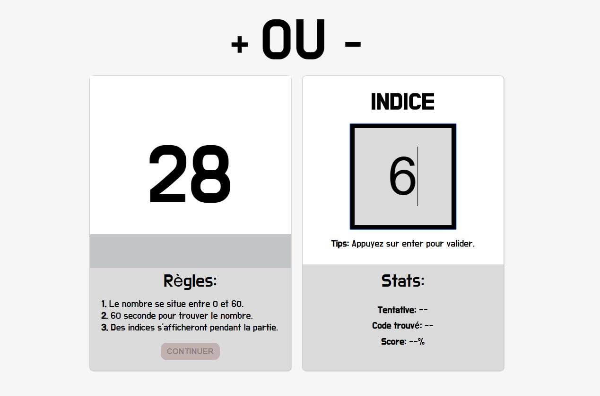

# GameJS:

## Le jeu du plus ou du moins:
Cliquez <a href="www.gamejs.surikate.be/plusoumoins.html"> ici</a> Pour commencer à jouer. (En maintenance)

Ou <a href="www.gamejs.surikate.be/"> ici</a> pour vous diriger vers l'index des jeux.

### Regles du jeu:

* Les règles sont extremement simple. Vous avez 60 secondes pour trouver le plus de bonnes réponses possible. 
* Au lancement de partie, vous aurrez une serie de nombres secrets à deviner, il seront tous a chaque fois compris entre 0 et 60. 
* En cas de mauvaise réponse, l'ordinateur vous donnera un indice.
* En cas de bonne réponse, l'odinateur stoppera le chronometre et comptabilisera la bonne réponse et génerera un nouveau nombre secret.
* A la fin du chronometre la partie se termine et l'ordinateur vous révele vos statistiques. Si vous récoltez un score au dessus de 50% alors vous avez gagné, sinon, recommencez ;-)

## Developpement:

## Installation:

* Telecharger ce fichier et l'ouvrir dans votre navigateur.
* Jouer online.

# SOURCES:

* https://www.grafikart.fr/
* https://www.w3schools.com/

